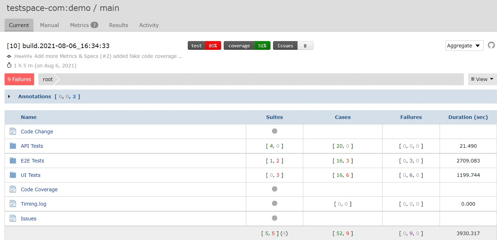

import ReactPlayer from 'react-player'

# Videos

## MP4

<ReactPlayer playing controls muted={true} url='/blog/triage.mp4' />

## YouTube

<ReactPlayer url='https://www.youtube.com/watch?v=ysz5S6PUM-U' />

## GIF

